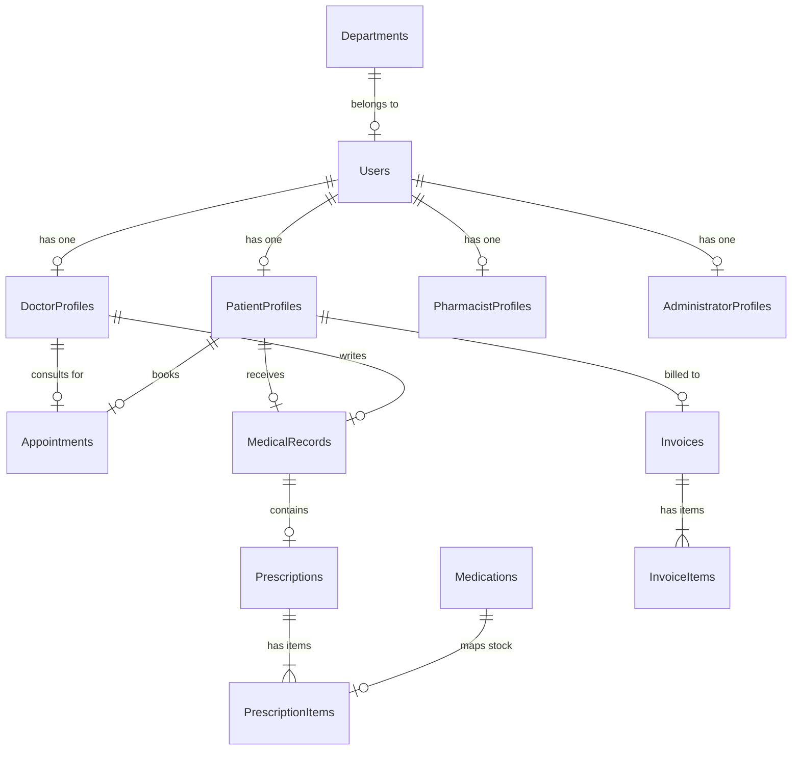

# MediTrack — Technical Documentation & Architecture Specification

MediTrack is a three-tier Hospital Management System (HMS) tailored for outpatient care, electronic health records (EHR) management, inventory control, and billing consolidation. This handbook serves as the technical reference for the system architecture, database design, REST APIs, client modules, and CI/CD configurations.

---

## 🏗️ System Architecture & Data Flow

```
+------------------------------------------+
|            PRESENTATION LAYER            |
|  [React Web Client]   [Flutter Mobile]   |
+--------------------+------------+--------+
                     |            |
                REST | HTTPS      | REST / HTTPS
                     v            v
+------------------------------------------+
|            APPLICATION LAYER             |
|        [Node.js + Express.js API]        |
|  - JWT Auth        - Stock Control       |
|  - Booking Lock    - Billing Accumulator |
+--------------------+---------------------+
                     |
       Sequelize ORM | PostgreSQL Dialect
                     v
+------------------------------------------+
|                DATA LAYER                |
|       [PostgreSQL / Supabase DB]         |
+------------------------------------------+
```

### Data Flow Triggers:
1. **Consultation & Prescription**: A doctor diagnoses a patient, creates an EHR record, and adds prescription items.
2. **Billing Generation**: Creating the EHR record triggers the Billing Accumulator to compile consultation fees and drug costs into a pending patient Invoice.
3. **Pharmacy Dispensing**: The pharmacist views the prescription queue. Tapping "Dispense" deducts quantities from the inventory stock database and updates the invoice.
4. **Appointment Scheduling**: Patients book appointments. The system executes a Sequelize database transaction with row-level locking to verify the doctor's availability.

---

## 💾 Database Schema (12 Relational Tables)

The database is built on PostgreSQL (hosted on Supabase) and mapped using Sequelize ORM.



### Table Definitions

#### 1. `Users`
Stores authentication credentials, contact info, and security parameters.
* `id` (INTEGER, Primary Key, Auto-Increment)
* `email` (VARCHAR, Unique, Indexed)
* `password_hash` (VARCHAR)
* `first_name` (VARCHAR)
* `last_name` (VARCHAR)
* `role` (ENUM: `'patient'`, `'doctor'`, `'pharmacist'`, `'admin'`)
* `phone` (VARCHAR)
* `department_id` (INTEGER, Foreign Key -> `Departments.id`, Nullable)
* `is_active` (BOOLEAN, Default: `true`)

#### 2. `Departments`
Defines hospital operational sectors and physical locations.
* `id` (INTEGER, Primary Key)
* `name` (VARCHAR, Unique)
* `description` (TEXT)
* `location` (VARCHAR)

#### 3. `PatientProfiles`
Tracks medical details, vitals, next of kin info, and demographics.
* `id` (INTEGER, Primary Key)
* `user_id` (INTEGER, Foreign Key -> `Users.id`)
* `date_of_birth` (DATE)
* `gender` (VARCHAR)
* `blood_type` (VARCHAR)
* `allergies` (TEXT)
* `emergency_contact_name` (VARCHAR)
* `emergency_contact_phone` (VARCHAR)

#### 4. `DoctorProfiles`
Stores doctor licenses, specialties, and session fees.
* `id` (INTEGER, Primary Key)
* `user_id` (INTEGER, Foreign Key -> `Users.id`)
* `specialization` (VARCHAR)
* `license_number` (VARCHAR, Unique)
* `consultation_fee` (DECIMAL(10,2))

#### 5. `Medications` (Pharmacy Inventory)
Monitors stock levels, prices, and replenishment indicators.
* `id` (INTEGER, Primary Key)
* `name` (VARCHAR)
* `generic_name` (VARCHAR)
* `category` (VARCHAR)
* `stock_quantity` (INTEGER)
* `unit_price` (DECIMAL(10,2))
* `reorder_level` (INTEGER)
* `supplier` (VARCHAR)

---

## 🔌 API Endpoint Reference

All endpoints (except login, signup, and public listings) require a `Bearer <JWT_TOKEN>` authorization header.

### 1. Authentication
* `POST /api/auth/register` — Creates a new user (default role: patient).
* `POST /api/auth/login` — Verifies password, updates login logs, and returns access token + user details.
* `POST /api/auth/refresh` — Rotates expired access tokens using HTTP-only cookies.
* `POST /api/auth/logout` — Revokes session access tokens.

### 2. Available Doctors
* `GET /api/doctors` — Returns all active doctors, including user profiles and department locations (Public).
* `GET /api/doctors/:id` — Details for a specific doctor.

### 3. Patient Portal
* `GET /api/patients/profile` — Retrieves the authenticated patient's profile, vitals, and next of kin info.
* `PUT /api/patients/profile` — Updates medical parameters (e.g. allergies, next of kin contact).
* `GET /api/patients/records` — Returns the patient's EHR and visit timeline.

### 4. Appointment Scheduler
* `POST /api/appointments` — Books a consultation slot.
  > [!IMPORTANT]
  > Uses database transaction blocks to detect time conflicts. If a request overlaps with an existing appointment for the same doctor, the transaction aborts and returns `409 Conflict`.
* `GET /api/appointments` — Lists the authenticated user's appointments (doctors see their list, patients see theirs).

### 5. Invoices & Billing
* `GET /api/billing/invoices` — Returns the patient's outstanding invoices.
* `PUT /api/billing/invoices/:id/pay` — Marks an invoice as paid.

---

## 📱 Patient Mobile Client (Flutter)

Built as a cross-platform client for iOS and Android, focusing on soft-UI aesthetics.

### Key Screens:
* **Dashboard Overview**: Displays summary cards (active appointments count, files count, bills sum) with shortcuts to secondary screens.
* **Available Doctors**: A searchable directory of active doctors. Tapping a doctor card opens the appointment scheduler.
* **Hospital Pharmacy**: Lists medications, stock counts, and prices.
  * **Mock Purchase Integration**: Tapping any drug prompts the patient to buy it. The app handles quantity limits, calculates costs, shows a dispensing loader, decrements stock in the list, and prints a success receipt.
* **EHR Timeline**: Shows diagnoses, clinical notes, and active prescriptions.

---

## 💻 HMS Web Portal (React + Vite)

The web application provides separate dashboards for hospital staff.

* **Admin Portal**: Displays monthly revenue bar charts using Recharts. Handles user registration (Doctors, Pharmacists) and department options.
* **Doctor Desk**: A queue showing scheduled consultations. Doctors can log clinical notes, record vitals, diagnose, and prescribe medications.
* **Pharmacy Desk**: Lists pending prescriptions. Tapping "Dispense" automatically decrements inventory counts.

---

## 🚀 Deployment & CI/CD Pipelines

### 1. Render & Vercel Production Routing
* **Server Deployment (Render)**: Serves static web frontend bundles from `client/dist` when running in production mode (`NODE_ENV=production`), serving both the API and client from a single service.
* **Frontend Deployment (Vercel)**: Configured via [`vercel.json`](file:///c:/Users/Lenovo%20ThinkBook/.gemini/antigravity-ide/scratch/meditrack/vercel.json) to handle dependency compilation and URL redirects.

### 2. Codemagic Workflow (`codemagic.yaml`)
Automates iOS builds on remote macOS runner VMs.
* **Trigger**: Triggered automatically on push events to the `master` branch.
* **Subdirectory builds**: Configured to run inside `/patient_mobile`.
* **Signing Configurations**: If App Store credentials are not set in the environment variables, it generates an unsigned IPA (`Runner.ipa`) by packing the compiled `.app` package into a zip archive for sideloading. If credentials are set, it builds a signed IPA for TestFlight distribution.
